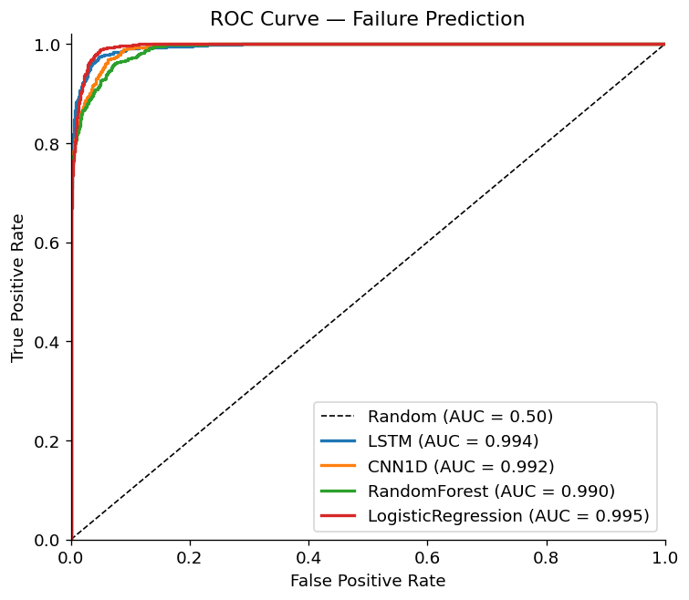
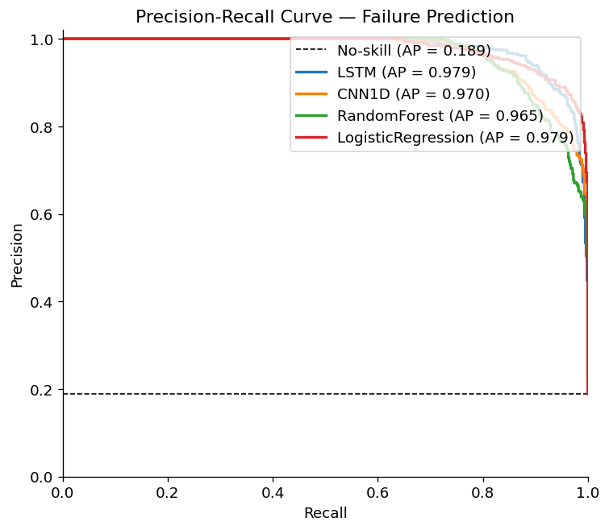
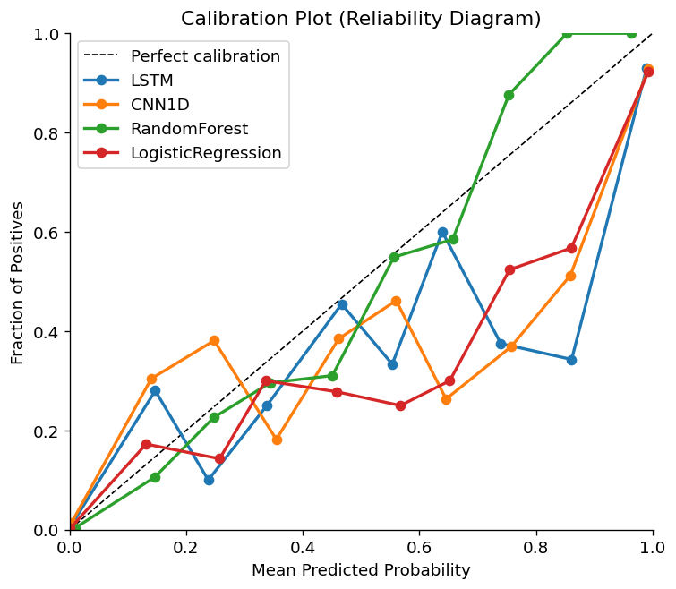
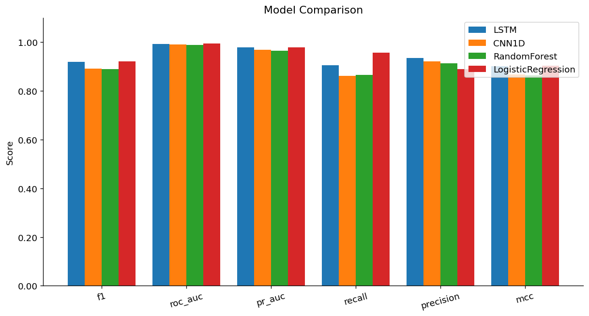
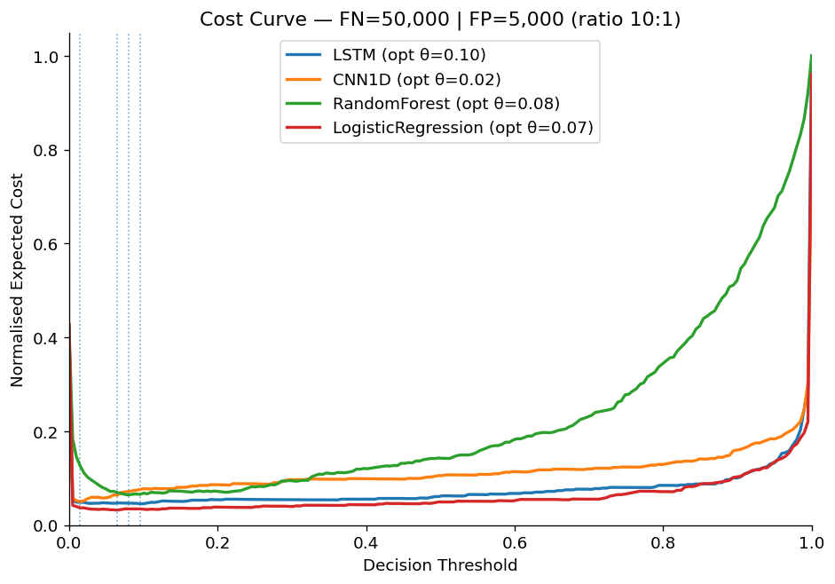
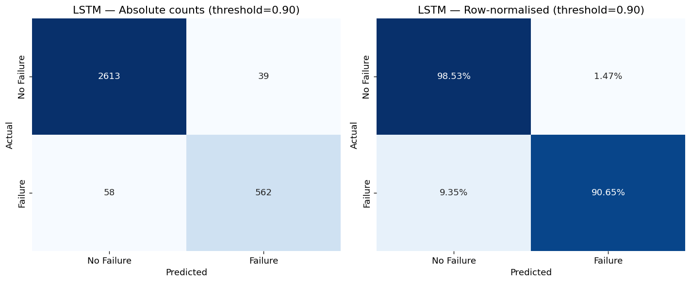

# Plataforma de Manutenção Preditiva com IA

> Sistema end-to-end de machine learning para previsão de falhas industriais, cobrindo todo o ciclo — da ingestão de dados ao deploy em produção. Inclui calibração probabilística, otimização de decisão baseada em custo, avaliação estatística robusta, interpretabilidade e visualização interativa.

    

---

## 📌 Navegação Rápida

- [O que este projeto demonstra](#o-que-este-projeto-demonstra)
- [Resultados](#resultados--nasa-cmapss-fd001)
- [Gráficos de Avaliação](#gráficos-de-avaliação)
- [Quick Start](#quick-start)
- [Arquitetura do Sistema](#arquitetura-do-sistema)
- [Modelos](#modelos)
- [Pipeline de Dados](#pipeline-de-dados)
- [Suite de Avaliação](#suite-de-avaliação)
- [API REST](#api-rest)
- [Limitações](#limitações)
- [Autor](#autor)

---

## O que este projeto demonstra

| Competência | Implementação |
|-------------|---------------|
| **Modelagem de séries temporais** | LSTM bidirecional, CNN temporal com dilatação residual |
| **Pipeline end-to-end** | Geração de dados → pré-processamento → treino → avaliação → API REST |
| **Dataset real (NASA CMAPSS)** | Loader completo para os 4 sub-datasets de degradação de turbinas |
| **Métricas para dados desbalanceados** | PR-AUC, F1, MCC, Brier Score, ECE |
| **Calibração probabilística** | Platt Scaling, Isotonic Regression, Expected Calibration Error |
| **Decisão orientada a custo** | Threshold otimizado por custo esperado ($50k FN vs $5k FP) |
| **Significância estatística** | Teste McNemar, DeLong AUC CI, permutation test, bootstrap CI |
| **Interpretabilidade** | Gradient saliency, permutation importance, importância intrínseca RF/LR |
| **Serving em produção** | FastAPI com schema Pydantic, health check, inferência com janela deslizante |
| **Experimentação rastreável** | MLflow tracking, Optuna HPO, ablation study (window size, pos_weight, capacidade) |
| **Dashboard interativo** | Streamlit com 5 abas: overview, benchmark, predição ao vivo, análise de erros, interpretabilidade |

---

## Resultados — NASA CMAPSS FD001

> Conjunto de teste: **3.272 janelas** | 20 motores | taxa de positivos: **18,95%**
> Threshold selecionado por maximização de F1. Bootstrap CI com n=500 amostras.

| Modelo | F1 | ROC-AUC | PR-AUC | Recall | Precision | MCC | Brier | ECE |
|--------|----|---------|--------|--------|-----------|-----|-------|-----|
| **Logistic Regression** | **0.9222** | **0.9950** | **0.9795** | **0.9565** | 0.8904 | **0.9041** | **0.0270** | **0.0229** |
| LSTM | 0.9206 | 0.9940 | 0.9789 | 0.9065 | **0.9351** | 0.9025 | 0.0283 | 0.0247 |
| CNN 1D | 0.8917 | 0.9919 | 0.9698 | 0.8629 | 0.9224 | 0.8681 | 0.0358 | 0.0326 |
| Random Forest | 0.8891 | 0.9897 | 0.9645 | 0.8661 | 0.9133 | 0.8644 | 0.0319 | 0.0239 |

**Intervalos de confiança 95% (Bootstrap, n=500):**

| Modelo | F1 [IC 95%] | ROC-AUC [IC 95%] | PR-AUC [IC 95%] |
|--------|-------------|-----------------|----------------|
| Logistic Regression | 0.9222 [0.907, 0.938] | 0.9950 [0.994, 0.996] | 0.9795 [0.973, 0.985] |
| LSTM | 0.9206 [0.905, 0.935] | 0.9940 [0.992, 0.996] | 0.9789 [0.973, 0.984] |
| CNN 1D | 0.8917 [0.873, 0.910] | 0.9919 [0.990, 0.994] | 0.9698 [0.962, 0.977] |
| Random Forest | 0.8891 [0.870, 0.906] | 0.9897 [0.987, 0.992] | 0.9645 [0.956, 0.972] |

> **Análise**: No FD001 (condição operacional única), a Regressão Logística apresenta desempenho surpreendentemente competitivo com os modelos neurais — o que é esperado quando os padrões de degradação são relativamente lineares e a condição é uniforme. O LSTM tem a maior precisão (0.9351), vantajosa no contexto de custo assimétrico onde falsos positivos são caros. Em datasets multi-condição como FD002/FD004, a superioridade dos modelos neurais deve ser mais pronunciada.

---

## Gráficos de Avaliação

> Gerados automaticamente pelo benchmark — NASA CMAPSS FD001.

<table>
<tr>
<td><br><em>Curvas ROC — todos os modelos</em></td>
<td><br><em>Curvas Precisão-Recall (métrica principal para dados desbalanceados)</em></td>
</tr>
<tr>
<td><br><em>Calibração probabilística — reliability diagram</em></td>
<td><br><em>Comparação de métricas entre modelos</em></td>
</tr>
<tr>
<td><br><em>Custo esperado por threshold — FN=$50k, FP=$5k</em></td>
<td><br><em>Matriz de confusão — LSTM</em></td>
</tr>
</table>

---


## Quick Start

```bash
# 1. Instalar dependências
pip install -r requirements.txt

# 2. Baixar e validar dados reais (NASA CMAPSS)
python scripts/prepare_cmapss.py

# 3. Treinar o modelo LSTM
python scripts/train_neural_model.py --model-type lstm --dataset cmapss

# 4. Benchmark completo (treina todos os modelos + gera relatório)
python scripts/run_full_benchmark.py --dataset cmapss --cmapss-subset FD001

# 5. Abrir dashboard
streamlit run streamlit_app.py
```

Para ver todas as opções disponíveis:

```bash
python cli.py --help
```

---

## Problema de Negócio

Falhas não planejadas em equipamentos industriais são eventos críticos e caros. Uma única falha num motor de linha de produção pode custar entre $50.000 e $500.000 em reparo emergencial, parada de produção e incidentes de segurança. A manutenção preventiva por intervalo fixo desperdiça recursos: a maioria das intervenções é desnecessária, e falhas ainda ocorrem entre os intervalos.

**Manutenção preditiva** resolve isso monitorando continuamente sensores (vibração, temperatura, pressão, corrente, RPM) e emitindo alertas quando uma falha é estatisticamente iminente dentro de um horizonte configurável — por exemplo, os próximos 30 ciclos de operação.

**Restrições de negócio incorporadas no design:**
- **Custos assimétricos**: uma falha não detectada (FN) custa ~10× mais que um alarme falso (FP)
- **Rótulos desbalanceados**: eventos de falha são raros — de 2% a 19% das janelas são positivas
- **Calibração importa**: equipes de planejamento precisam confiar no score de probabilidade, não apenas no alerta binário
- **Múltiplos perfis de degradação**: diferentes tipos de máquina degradam de formas distintas

---

## Formulação Técnica

Dado uma série temporal multivariada de sensores **x**₁:T ∈ ℝ^(T×F), o objetivo é estimar:

```
ŷ = P(falha nos próximos H ciclos | x₁:T)
```

onde H=30 é o horizonte de falha.

Formulado como **classificação binária em janela deslizante**:
- Janelas extraídas por máquina com stride configurável
- Label = 1 se um evento de falha ocorre nos próximos H passos após o fim da janela
- Split a nível de máquina para prevenir vazamento temporal

---

## Datasets

### NASA CMAPSS — Dado Real

Dataset de degradação de turbinas a jato (simulação baseada em física). Referência amplamente utilizada na literatura de PHM (Prognostics and Health Management).

| Sub-dataset | Motores treino | Motores teste | Cond. operacionais | Modos de falha |
|-------------|---------------|---------------|--------------------|----------------|
| **FD001** | 100 | 100 | 1 | 1 |
| **FD002** | 260 | 259 | 6 | 1 |
| **FD003** | 100 | 100 | 1 | 2 |
| **FD004** | 249 | 248 | 6 | 2 |

**Decisões de design para o CMAPSS:**
- **7 sensores quasi-constantes removidos** `{1,5,6,10,16,18,19}` — mantém os 14 sensores com variação informativa
- **RUL limitado a 125 ciclos** — seguindo convenção da literatura: na fase estável inicial, o RUL é tratado como constante
- **`window_size=30`** — cada ciclo CMAPSS é mais granular que um timestep sintético
- **`RobustScaler`** em vez de `StandardScaler` — necessário para distribuições multi-modais em FD002/FD004, causadas por diferentes condições operacionais
- **Split a nível de motor** — o ciclo de vida completo de cada motor fica integralmente em um único conjunto, eliminando vazamento temporal
- **Schema idêntico ao dado sintético** — zero alterações no pipeline de pré-processamento downstream

### Gerador Sintético v2

Utilizado para desenvolvimento, ablation studies e testes de pipeline quando dados reais não estão disponíveis.

| Característica | Descrição |
|----------------|-----------|
| **Degradação não-monotônica** | Oscilação senoidal durante a fase de degradação — simula recuperação transiente observada em rolamentos reais |
| **Step faults** | 25% das máquinas têm um salto abrupto nos sensores (simula ruptura de vedação, falha de lubrificação) |
| **Sensores correlacionados** | Acoplamento físico temperatura ↔ corrente: `T += α × I[t-1]` |
| **Ruído heavy-tail** | Gaussian + Laplace (70/30) para simular outliers de sensor sem picos catastróficos |
| **Sensor dropout** | Preenchimento para frente aleatório simula falhas de comunicação do sensor |
| **Posição de falha variável** | A falha ocorre nos últimos 10% do ciclo de vida em posição aleatória — não necessariamente no último timestep |

---

## Arquitetura do Sistema

```
┌─────────────────────────────────────────────────────────────────────┐
│                  PREDICTIVE MAINTENANCE AI PLATFORM                  │
├───────────────┬───────────────┬───────────────┬─────────────────────┤
│  DADOS        │  MODELOS      │  AVALIAÇÃO    │  SERVING            │
│               │               │               │                     │
│ Sintético v2  │ LSTM          │ Calibração    │ FastAPI /predict    │
│ NASA CMAPSS   │ CNN 1D        │ Análise custo │ Pydantic schemas    │
│               │ Random Forest │ Significância │ Health endpoint     │
│ Preprocessor  │ Logistic Reg  │ Análise erros │                     │
│ (windowing,   │               │ Interpretabil.│ MLflow tracking     │
│  scaling,     │ Optuna HPO    │ Bootstrap CI  │ Streamlit dashboard │
│  splits)      │               │ Viz completa  │                     │
├───────────────┴───────────────┴───────────────┴─────────────────────┤
│                           CLI (click)                                │
│    generate | train | evaluate | tune | compare | ablation | serve   │
└─────────────────────────────────────────────────────────────────────┘
```

---

## Modelos

### LSTM Classifier

| Componente | Detalhe |
|------------|---------|
| Arquitetura | LSTM → LayerNorm → Dropout(0.3) → Linear(→1) |
| Loss | BCEWithLogitsLoss + pos_weight automático (n_neg/n_pos) |
| Otimizador | AdamW (lr=1e-3, weight_decay=1e-4) |
| Scheduler | ReduceLROnPlateau (factor=0.5, patience=5) |
| Inicialização | Xavier (pesos de entrada), Orthogonal (recorrente), forget bias=1 |
| Gradient clipping | max_norm=1.0 |
| Early stopping | val_F1, patience=10 (CMAPSS) / 15 (sintético) |
| Parâmetros | ~206k |

> O bias do forget gate inicializado em 1.0 é um ajuste amplamente utilizado que evita o desaparecimento de gradientes no início do treino — a LSTM aprende a reter informação por padrão antes de qualquer gradiente corrigir esse comportamento.

### CNN Temporal (1D Residual)

| Componente | Detalhe |
|------------|---------|
| Arquitetura | Stem(1×1) → 4× ResidualBlock1D(dilation=1,2,4,8) → GlobalAvgPool → Dropout → FC |
| Padrão de dilatação | Dobra a cada bloco: campo receptivo efetivo = 8×(kernel-1)+1 |
| Ativação | GELU em todo o modelo |
| Normalização | BatchNorm1d por camada convolucional |
| Vantagem vs LSTM | Totalmente paralelizável, sem dependência sequencial; sem risco de gradientes que desaparecem |
| Parâmetros | ~180k |

### Baselines sklearn

| Modelo | Notas |
|--------|-------|
| Random Forest | 200 árvores, max_depth=12, balanced class_weight |
| Logistic Regression | Regularização L2 (C=1.0), StandardScaler no pipeline |

Os baselines achatam as janelas para (N, T×F) — não capturam ordenação temporal, mas funcionam como referência sólida e são surpreendentemente competitivos em FD001 (condição uniforme).

---

## Pipeline de Dados

```
DataFrame bruto (machine_id, timestep, sensores, labels)
         ↓
Split a nível de máquina (sem janela cruzando dois motores, sem motor em dois conjuntos)
         ↓
RobustScaler / StandardScaler ajustado APENAS com máquinas de treino
         ↓
Extração de janela deslizante: (N, window_size, n_features)
Label = valor de failure_imminent no último timestep da janela
         ↓
(X_train, y_train), (X_val, y_val), (X_test, y_test)
```

**Por que split a nível de máquina?**
O split aleatório por janela cria vazamento severo: janelas consecutivas da mesma máquina compartilham ~90% dos timesteps. Um modelo treinado nas janelas 1–49 do motor X trivialmente prediz a janela 2–50 — não há nada a aprender. O split por motor garante que o conjunto de teste contém máquinas que o modelo **nunca viu em nenhum estado**.

---

## Suite de Avaliação

### Métricas

| Métrica | Por que importa aqui |
|---------|----------------------|
| **PR-AUC** | Métrica primária para dados desbalanceados — a ROC-AUC é otimista quando os negativos dominam |
| **F1** | Média harmônica de precisão e recall, calculada no threshold ótimo |
| **MCC** | Matthews Correlation Coefficient — robusto ao desbalanceamento de classes |
| **Brier Score** | Mede a qualidade de calibração das probabilidades (0 = perfeito) |
| **ECE** | Expected Calibration Error — erro médio ponderado `|probabilidade prevista − frequência real|` por bin |
| **Custo Esperado** | Métrica de negócio: FN×$50k + FP×$5k no threshold ótimo de custo |

### Calibração Probabilística

Probabilidades brutas de modelos neurais costumam ser mal calibradas — tendem a ser excessivamente confiantes ou conservadoras. Para corrigir isso, são aplicadas duas abordagens de calibração post-hoc:
- **Platt Scaling**: regressão logística sobre os scores brutos, ajustada no conjunto de validação
- **Isotonic Regression**: calibração monotônica não-paramétrica (requer pelo menos 1.000 amostras de validação)
- Qualidade avaliada por Brier Score e ECE antes e após a correção

### Seleção de Threshold por Custo

O threshold F1-ótimo trata FP e FN de forma igualitária, o que não reflete o domínio. A formulação correta é:

```
t* = C_FP × prevalência / (C_FP × prevalência + C_FN × (1 − prevalência))
```

Com C_FN=$50k, C_FP=$5k e prevalência≈0.19 (CMAPSS FD001), o threshold teórico ótimo é ~0.09 — muito mais agressivo que o padrão de 0.5. Na prática, o threshold é encontrado varrendo a curva de custo esperado empiricamente.

### Testes de Significância Estatística

| Teste | O que mede |
|-------|-----------|
| **McNemar** | Se dois classificadores cometem erros significativamente diferentes (qui-quadrado, gl=1) |
| **DeLong AUC CI** | IC 95% para diferença de AUC sem bootstrap, usando placement values (60× mais rápido) |
| **Permutation test** | Diferença de AUC sob permutação aleatória de labels; sem pressupostos distribucionais |
| **Bootstrap CI** | IC 95% para F1, AUC, MCC via 500 reamostras não-paramétricas |

---

## Interpretabilidade

| Abordagem | Modelos | O que revela |
|-----------|---------|-------------|
| **Importância intrínseca** | RF (`feature_importances_`), LR (`\|coef\|`) | Qual sensor × posição temporal contribuiu mais para as predições |
| **Gradient saliency** | LSTM, CNN | dSaída/dEntrada — sensibilidade a perturbações em cada posição (t, f) |
| **Permutation importance (sensor)** | Todos | Queda de F1 ao permutar um sensor — testa se o modelo de fato o utiliza |
| **Permutation importance (temporal)** | Todos | Queda de F1 por bin temporal — revela se timesteps recentes têm mais peso |

```bash
python scripts/run_interpretability.py --dataset cmapss
```

---

## Estrutura do Projeto

```
predictive-maintenance-ai-platform/
├── src/
│   ├── data/
│   │   ├── synthetic_generator.py   # v2: degradação não-monotônica, step faults, sensores correlacionados
│   │   ├── cmapss_loader.py         # loader NASA CMAPSS (todos os 4 sub-datasets)
│   │   ├── dataset_factory.py       # load_dataset() unificado para sintético e CMAPSS
│   │   ├── preprocessing.py         # windowing, split por máquina, scaling
│   │   ├── dataset.py               # PyTorch Dataset + DataLoader factory
│   │   └── data_validator.py        # validação de schema + detecção de drift (PSI)
│   ├── models/
│   │   ├── lstm_model.py            # LSTM + LayerNorm + forget-gate bias init
│   │   ├── cnn_model.py             # CNN 1D residual dilatado + GlobalAvgPool
│   │   └── baseline.py              # Random Forest + Logistic Regression
│   ├── experiments/
│   │   ├── trainer.py               # training loop + MLflow + early stopping
│   │   └── hyperparameter_search.py # Optuna TPE + MedianPruner
│   ├── evaluation/
│   │   ├── metrics.py               # F1, AUC, MCC, PR-AUC, threshold sweep
│   │   ├── calibration.py           # Platt, Isotonic, Brier Score, ECE
│   │   ├── cost_analysis.py         # CostMatrix, threshold ótimo por custo
│   │   ├── significance_testing.py  # McNemar, DeLong AUC CI, permutation test
│   │   ├── statistical_analysis.py  # Bootstrap CI, análise de calibração
│   │   ├── error_analysis.py        # detalhamento FP/FN por tipo de máquina / fase / proximidade
│   │   ├── interpretability.py      # gradient saliency, permutation importance
│   │   └── visualization.py         # ROC, PR, CM, calibração, curvas de custo, heatmaps
│   ├── api/
│   │   ├── main.py                  # FastAPI app + lifespan
│   │   ├── predictor.py             # carregamento do modelo + inferência
│   │   └── schemas.py               # schemas Pydantic de request/response
│   └── utils/
│       ├── config.py                # merge de YAML + acesso por dot-notation
│       ├── checkpointing.py         # save/load checkpoint
│       └── logger.py                # logging estruturado
├── scripts/
│   ├── run_full_benchmark.py        # MASTER: generate → train → benchmark → relatório (--dataset)
│   ├── train_neural_model.py        # treino LSTM ou CNN (--model-type, --dataset)
│   ├── train_baseline.py            # treino RF + LR (--dataset)
│   ├── prepare_cmapss.py            # download + validação do NASA CMAPSS
│   ├── run_error_analysis.py        # detalhamento FP/FN
│   ├── run_interpretability.py      # importância de features para todos os modelos
│   ├── ablation_study.py            # window size, pos_weight, capacidade, LSTM vs CNN
│   ├── evaluate_model.py            # avaliação de modelo único
│   └── run_hyperparameter_search.py # HPO com Optuna
├── configs/
│   ├── base_config.yaml             # config de dados, treino, avaliação
│   ├── cmapss_config.yaml           # overrides para CMAPSS (window, scaler, epochs)
│   └── model_config.yaml            # arquitetura e search spaces do HPO
├── tests/                           # pytest com 9 módulos de teste
├── assets/images/                   # imagens para o README (copiar de reports/ após benchmark)
├── streamlit_app.py                 # dashboard interativo (5 abas)
├── cli.py                           # CLI unificado (click) com --dataset/--cmapss-subset
├── requirements.txt
└── Dockerfile
```

---

## Execução Completa

### Dado Sintético

```bash
# Gerar 200 máquinas
python cli.py generate --n-machines 200

# Pipeline completo
python scripts/run_full_benchmark.py --n-machines 200 --epochs 50
```

### NASA CMAPSS

```bash
# Baixar e validar os dados
python scripts/prepare_cmapss.py

# Treinar individualmente
python scripts/train_neural_model.py --model-type lstm --dataset cmapss
python scripts/train_neural_model.py --model-type cnn  --dataset cmapss
python scripts/train_baseline.py --dataset cmapss

# Pipeline completo — FD001
python scripts/run_full_benchmark.py --dataset cmapss --cmapss-subset FD001

# Dataset mais difícil — FD002 (6 condições operacionais)
python scripts/run_full_benchmark.py --dataset cmapss --cmapss-subset FD002 --epochs 80

# Via CLI unificado
python cli.py train --model lstm --dataset cmapss --cmapss-subset FD001
python cli.py compare --dataset cmapss --skip-training
```

### Análise e Interpretabilidade

```bash
# Análise de erros (FP/FN por segmento)
python scripts/run_error_analysis.py --dataset cmapss

# Importância de features e saliency
python scripts/run_interpretability.py --dataset cmapss

# HPO com Optuna
python cli.py tune --n-trials 50 --timeout 3600

# Ablation study (window size, pos_weight, capacidade, LSTM vs CNN)
python cli.py ablation
```

---

## API REST

```bash
# Iniciar servidor
python cli.py serve
# → http://localhost:8000/docs
```

```
# Health check
GET /health
→ {"status": "healthy", "model_loaded": true, "model_type": "lstm"}

# Predição
POST /predict
{
  "sensor_window": [
    {"temperature": 82.1, "vibration": 0.95, "pressure": 6.3, "rpm": 1820, "current": 13.4},
    ... (50 leituras no total para dado sintético)
  ],
  "threshold": 0.5
}
→ {
    "failure_probability": 0.823,
    "failure_imminent": true,
    "threshold_used": 0.5,
    "model_name": "lstm"
  }

# Predição via CLI (janela preenchida com a leitura repetida)
python cli.py predict \
  --temperature 88.3 --vibration 1.47 --pressure 6.1 --rpm 1850 --current 14.2
```

---

## Limitações

| Limitação | Impacto | Mitigação |
|-----------|---------|-----------|
| **FD001 é o dataset mais simples** | Resultados podem não generalizar para FD002/FD004 | Scripts suportam todos os subsets; FD002/FD004 são os benchmarks mais desafiadores e representativos |
| **Window size fixo** | Não se adapta a máquinas com dinâmicas temporais distintas | Ablation cobre T∈{10,25,50,100}; configurável por deployment |
| **Sem aprendizado incremental** | Drift de modelo tratado por retreino completo | Alertas de PSI disparam retreino; o calibrador pode ser atualizado sem retreinar o modelo base |
| **Gradient saliency é local** | Gradientes de entrada refletem sensibilidade linear local, não causalidade global | Permutation importance fornece uma visão global complementar |
| **LSTM usa apenas o último hidden state** | Sequências longas (>500 timesteps) podem perder sinal do início | Flag bidirectional disponível; atenção é extensão natural |

---

## Próximos Passos

1. **Mecanismo de atenção**: substituir o último hidden state por multi-head self-attention pooling
2. **Transformer encoder**: positional encoding + self-attention para desempenho estado da arte
3. **Fine-tuning por tipo de máquina**: backbone compartilhado, heads ajustados por categoria
4. **Calibração online**: atualizar o Platt Scaler incrementalmente com dados de produção
5. **SHAP**: TreeSHAP para Random Forest (exato), GradientSHAP para modelos neurais
6. **Integração com sensores reais**: ingestão via Kafka/MQTT, janela deslizante sobre stream ao vivo
7. **Quantificação de incerteza**: Monte Carlo Dropout na inferência para estimar incerteza epistêmica

---

## Dependências

```
torch>=2.1.0          scikit-learn>=1.3.0   numpy>=1.24.0
pandas>=2.0.0         scipy>=1.11.0         matplotlib>=3.7.0
seaborn>=0.12.0       mlflow>=2.7.0         fastapi>=0.103.0
pydantic>=2.3.0       uvicorn>=0.23.0       optuna>=3.3.0
pyyaml>=6.0           python-dotenv>=1.0.0  pytest>=7.4.0
pytest-cov>=4.1.0     httpx>=0.24.0         click>=8.1.0
tqdm>=4.65.0          joblib>=1.3.0         streamlit>=1.28.0
plotly>=5.18.0
```

---

## Testes

```bash
pytest tests/ -v --cov=src --cov-report=term-missing
```

9 módulos de teste cobrindo: validação de schema, pré-processamento, modelos, métricas, calibração, API, Dataset/DataLoader.

---

## 👤 Autor

**Alexandre Flores Jacques**

- GitHub: [github.com/floresjacques26](https://github.com/floresjacques26)
- LinkedIn: [linkedin.com/in/alexandre-jacques-237857256](https://www.linkedin.com/in/alexandre-jacques-237857256/)

Engenheiro de IA focado em modelagem, avaliação estatística e sistemas de Machine Learning aplicados a problemas industriais reais. Este projeto demonstra domínio completo do ciclo de vida de ML — da definição do problema de negócio ao sistema em produção com dados reais.
